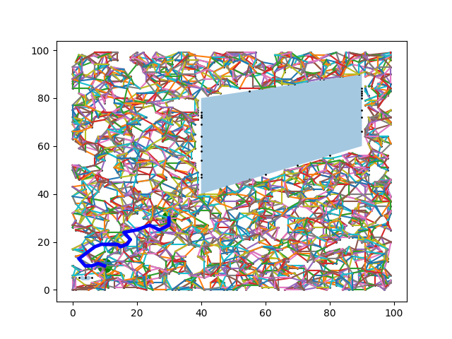

# Polygon-Obstacle-Avoidance-Shortest-Path-Planning
(PRM)Probabilistic Roadmaps is a path planning algorithm used in Robotics.

## How to run
```
pip install -r requirements.txt
python main.py
```

You can also specify number of samples:
```
python main.py --numSamples [number]
```

## Example Path

### PRM with sample polygon points.


### PRM with 1000 sample points.



## Steps of algorithm
1. Generate n random samples called milestones.
2. Check if milestones are collision free.
3. Find k valid neighbours/paths:
   - Link each milestone to k nearest neighbours.
   - Retain collision free links as local paths.
4. Search for shortest path from start to end node using an algoruthm. In this case we are using Dijksta's shortest path algorithm.

## PRM vs RRT (Randomly Expanding Trees)
PRM was choosen since it is probabilistically complete and in a small map like the one given in this problem, sampling is time efficient.

## Problem
"You are given as input the current and target coordinates of a robot, as well as the top left and bottom right points of rectangular obstacles."

## How to Specify Obstacles - Use environment.txt
```
starting point;target point
list of obstacle coordinates
-1
```
Example:
```
10,10;80,30
20,10;20,50
20,50;90,50
30,30;40,40
-1
```
